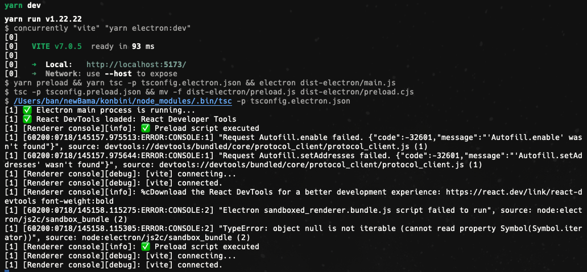

# Konbini POS

Proyecto base para una aplicación de Punto de Venta (POS) instalable, construida con:

- **Electron** para el entorno de escritorio
- **React 19 + Vite** para la interfaz de usuario
- **TypeScript** en todo el stack
- **Arquitectura modular y limpia (DDD)**

## 🚀 Stack técnico

| Categoría            | Tecnología                      |
|----------------------|----------------------------------|
| Plataforma Desktop   | Electron                        |
| Front-end            | React 19 + Vite                 |
| Lenguaje             | TypeScript                      |
| Empaquetador         | electron-builder                |
| Base del proyecto    | Vite + React + Tailwind + MUI   |
| Comunicación interna | contextBridge (preload)         |

## 🧩 Configuración del proyecto

- Se configuró `jsx: "react-jsx"` en `tsconfig.json` para permitir JSX moderno sin necesidad de `import React`.
- Se definió un alias `@` en `vite.config.ts` y `tsconfig.json`, apuntando a la carpeta `src`.  
  Esto permite importar con rutas absolutas como:

```ts
import logo from '@/path/file.extension'
```

en lugar de:

```ts
import logo from '../../path/file.extension'
```

## 📁 Estructura básica

```
konbini/
├── electron/             # Código fuente de procesos de Electron (main y preload)
│   ├── main.ts            # Proceso principal de Electron (incluye desactivación de warning de seguridad en dev)
│   └── preload.ts
├── dist-electron/        # Código compilado de Electron (main.js, preload.cjs)
├── src/                  # Código React (renderer)
├── tsconfig.*.json       # Configs separadas para Electron y preload
└── package.json
```

## 🔧 Scripts disponibles

- `yarn dev:web` - Inicia el servidor de desarrollo de Vite para la aplicación web.
- `yarn dev` - Inicia la aplicación en modo desarrollo con Electron y Vite.
- `yarn electron:dev` - Compila y ejecuta la aplicación Electron en modo desarrollo.
- `yarn build` - Construye la aplicación para producción (web y Electron).
- `yarn dist` - Empaqueta la aplicación para distribución usando electron-builder.
- `yarn preload` - Compila el preload (`preload.ts`) y lo renombra automáticamente a `preload.cjs` (usado internamente por `yarn dev`).

## 🧠 Detalles importantes

- El `preload.ts` se compila como CommonJS y se renombra automáticamente a `preload.cjs` mediante el script `yarn preload`, lo cual permite que Electron lo cargue correctamente incluso cuando el proyecto usa `"type": "module"` en `package.json`.
- El contexto seguro entre frontend y backend se maneja vía `contextBridge` expuesto en `window.electronAPI`.
- El paquete `electron-builder-squirrel-windows` ha sido agregado explícitamente en `package.json` solo para evitar un warning de peer dependency durante la instalación. No se utiliza activamente en el proyecto a menos que se requiera empaquetado con Squirrel en Windows.

## 🧼 Warnings esperados durante instalación

Al ejecutar `yarn install`, es posible que veas advertencias como:

```
warning electron > @electron/get > global-agent > boolean@3.2.0: Package no longer supported.
warning electron-builder > app-builder-lib > glob@7.2.3: Glob versions prior to v9 are no longer supported
...
```

Estas provienen de dependencias transitorias de Electron y electron-builder, y no afectan el funcionamiento del proyecto.


## 🔍 React DevTools en modo desarrollo

Esta aplicación incluye soporte para React Developer Tools durante el desarrollo con Electron.

### 🧩 Cómo funciona

> 🔗 Basado en la guía oficial de Electron: https://www.electronjs.org/docs/latest/tutorial/devtools-extension

- La extensión de React DevTools versión 6.1.5 fue descargada localmente desde Chrome y copiada al directorio del proyecto en `extensions/react-devtools/`.
- Electron carga esa extensión automáticamente desde esa ruta al iniciar en modo desarrollo.
- El hook `__REACT_DEVTOOLS_GLOBAL_HOOK__` se expone desde el `preload.ts` para que DevTools pueda engancharse.
- En algunos entornos, la pestaña ⚛️ Components no aparece al primer render. Puedes forzarla recargando la ventana con `Cmd + R`.

### 🛠 Recomendaciones

- No elimines `contextIsolation: true`, ya que es requerido para que `contextBridge` y el preload funcionen correctamente.
- Si modificas `preload.ts`, ejecuta `yarn preload` antes de relanzar la app o simplemente corre `yarn dev`, que ya lo incluye.

### ⚠️ Notas sobre mensajes en consola

Durante el desarrollo es posible que aparezcan los siguientes mensajes en la terminal (no en DevTools):

- `"Request Autofill.enable failed..."`
- `"Request Extensions.getStorageItems failed..."`
- `"Electron sandboxed_renderer.bundle.js script failed to run"`
- `"TypeError: object null is not iterable"`

Estos errores provienen de los módulos internos de Chromium o extensiones embebidas como React DevTools y **no afectan el funcionamiento de tu aplicación**.  
Pueden ser ignorados con seguridad.

Además, el listener `console-message` ha sido actualizado con la firma moderna recomendada por Electron para filtrar correctamente los logs no deseados en la terminal.



## ❓ ¿Qué es el preload?

El archivo `preload.ts` es un script especial que corre en el contexto aislado entre el proceso principal de Electron (Node.js) y la interfaz (React).

Su propósito es:

- **Permitir comunicación segura** entre el backend (Electron) y el frontend (React)
- **Exponer funciones autorizadas** al entorno del navegador usando `contextBridge`

Por ejemplo:

```ts
// preload.ts
contextBridge.exposeInMainWorld('electronAPI', {
  ping: () => 'pong',
})
```

Esto permite que en el frontend puedas usar:

```ts
window.electronAPI.ping()
```

Esta arquitectura mejora la seguridad y el control de lo que se expone al navegador, siguiendo las mejores prácticas recomendadas por Electron.

## ✅ Estado actual

✔️ Vite + React renderiza correctamente  
✔️ Electron levanta sin errores  
✔️ `preload.cjs` funciona y expone funciones  
✔️ Ideal para modularizar dominios tipo DDD

---

Siguientes pasos:
- Agregar módulos por dominio (productos, ventas, etc.)
- Integrar almacenamiento offline y sincronización
- Crear estructura de carpetas escalable por dominio

## 📂 Archivos ignorados en Git

El proyecto incluye un archivo `.gitignore` que previene subir archivos innecesarios al repositorio. Esto incluye:

- `node_modules/` y archivos de instalación
- Carpeta `dist/` y `dist-electron/`
- Archivos intermedios como `preload.js`
- Archivos de configuración local (`.vscode/`, `.idea/`, `.DS_Store`)
- Artifacts de empaquetado y actualización (`build/`, `out/`)
- Archivos de cobertura de tests (`coverage/`)
- Archivos temporales de TypeScript (`*.tsbuildinfo`)

Esto ayuda a mantener un repositorio limpio y enfocado solo en el código fuente relevante.

## 🎨 Integración con Tailwind CSS v4

Este proyecto utiliza [Tailwind CSS v4](https://tailwindcss.com/blog/tailwindcss-v4) con integración moderna vía Vite.

### ✅ Instalación y configuración

- Tailwind se integra mediante el plugin oficial `@tailwindcss/vite`
- No se requiere `postcss.config.js`
- No es necesario un archivo `tailwind.config.ts` a menos que desees extender el tema
- El archivo global de estilos (`index.css`) debe contener únicamente:

```css
@import "tailwindcss";
```

- Este archivo debe ser importado en `main.tsx`:

```ts
import "@/styles/index.css";
```

### 🎨 Personalización del tema

Tailwind v4 promueve un enfoque "CSS-first" usando la regla `@theme` directamente en CSS. Por ejemplo:

```css
@theme {
  --color-primary: #ef9c2c;
  --color-secondary: blue;
  --color-bama-white: #ffffff;
  --color-bama-purple: #6c63ff;
}
```

Estas variables pueden usarse con clases personalizadas o estilos CSS estándar.

### ⚠️ Consideraciones

- Tailwind aplica un reset global de estilos (`preflight`) que puede afectar estilos por defecto del navegador
- Para restaurar el comportamiento visual esperado, utiliza utilidades como `flex`, `items-center`, `gap`, `text-center`, etc.
- Evita usar `@import "tailwindcss"` dentro de archivos como `App.css` para prevenir conflictos o duplicaciones de estilos